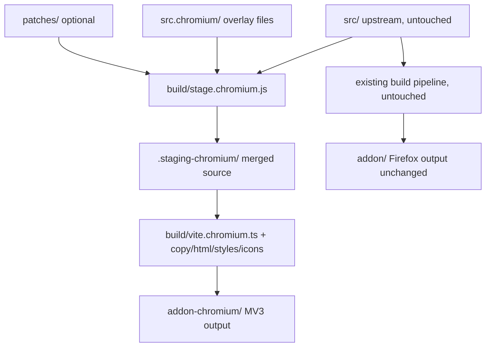

# Sidebery → Chrome/Chromium (Manifest V3) Migration Plan

Status: **decided — ready for implementation**
(API claims verified against developer.chrome.com and MDN docs, 2026-07; items marked
"verified" were cross-checked; items marked "verify" still need an empirical test in Chrome.)

## 0. Decisions

| # | Question | Decision |
|---|---|---|
| 1 | Minimum Chromium version | **150+ (track latest stable).** No compat fallbacks or version checks anywhere; all modern APIs can be assumed. Notably, ≥150 gives us: `sidePanel.open()` (116+), `sidePanel.close()` (141+), `sidePanel.onOpened`/`onClosed` events (141/142+), `runtime.getContexts()` (116+), `alarms.persistAcrossSessions` (properly supported exactly from 150), `storage.session` with 10 MB quota (111+), promise-based `chrome.*` everywhere. |
| 2 | Sync | **Hidden entirely on Chromium.** No Firefox Sync backend, and Google Drive sync is dropped along with it (self-distribution makes the OAuth client registration/redirect-origin burden not worth it). The whole Sync surface (settings section, sync popup, sidebar sync panel) is hidden. Can be revisited later — `chrome.identity.launchWebAuthFlow` works, so Google Drive is re-enableable if ever wanted. |
| 3 | Tab previews | **Dropped entirely.** No screenshot mode, no title/URL-only fallback. Settings section hidden, `popup.preview`/injection paths excluded from the Chromium build. |
| 4 | Distribution | **Self-distributed** (no Chrome Web Store). Ship a zip for "Load unpacked" / enterprise policy install. Pin the extension ID via `manifest.key` so the ID is stable across machines (matters for `chrome-extension://<id>/...` URLs stored in snapshots/config and for the profile-id logic). |
| 5 | Overlay mechanics | **Staging-copy build** (see §1). Chosen over Vite resolve-aliasing because it uniformly supports overlaying `.ts`, `.vue`, `.styl`, `.html`, and JSON, and gives `patches/` a natural application point. |
| 6 | Upstreaming | **None — maintained as a fork.** Still keep the additive/overlay discipline strictly: the goal is minimal-conflict `git merge upstream/v5` syncs, not upstream acceptance. |

## 0.1 Goals and principles

- Produce a working Chromium MV3 build of Sidebery from this repository.
- **Add files instead of modifying files.** All Chromium-specific code lives in new
  files/directories. Where upstream files *must* change, do it via (in order of preference):
  1. **Overlay** — a file at `src.chromium/<path>` shadows `src/<path>` in the staged
     Chromium build (zero diff in upstream files).
  2. **Build-time transforms** — small transforms applied by the Chromium build scripts
     (like the existing `handleManifest()` in `build/copy.js`).
  3. **Patch files** — `patches/*.patch` applied to the build staging dir, never to the
     working tree (last resort, for surgical changes inside large files where a full-file
     overlay would shadow too much and rot too fast).
- **Remove or hide Firefox-only features** on Chromium: Containers, Sync, per-container
  proxy, tab hiding, tab previews, Firefox theme integration, etc. (full list in §4).
- The Firefox build must remain byte-identical in behavior — Chromium support is purely
  additive. The only upstream files we edit at all are `package.json` (added scripts/dev-deps)
  and possibly `.gitignore` — both trivially mergeable.

### What upstream already gives us

- `build/copy.js` → `handleManifest()` already patches the manifest when `--chromium` is
  passed (MV2-targeted; we won't use it, but it shows the shape of the problem).
- `build/scripts.js` (legacy esbuild pipeline) already defines `browser: 'chrome'` for
  Chromium. Note: the current default pipeline is `build/vite.ts` (used by `npm run build`),
  which has **no** Chromium handling.
- `build/webext.run.js` already supports launching a Chromium binary — reusable for
  `dev.chromium.run`.

---

## 1. High-level architecture of the port

Mechanism (staging-copy, per decision #5):

1. **`build/stage.chromium.js`** (new):
   - copy `src/` → `.staging-chromium/src/` (fast, mtime-aware for dev watch);
   - overlay-copy `src.chromium/` on top (same relative paths shadow upstream files;
     new paths add files);
   - apply `patches/*.patch` (if any) to the staging dir;
   - in dev mode: watch both roots and re-stage changed files.
2. **`src.chromium/` overlay directory** (new). Mirrors `src/` paths. Contains:
   - `manifest.json` — a *separate, complete MV3 manifest* (§2), including the pinned
     `key` for a stable extension ID (decision #4);
   - replacement modules (stubs for containers/sync/web-req, SW background entry, etc.);
   - the platform adapter (`platform/` — §3);
   - `types/chrome-shim.d.ts` so overlay code type-checks without touching upstream
     `src/types/web-ext.d.ts`.
3. **`build/vite.chromium.ts`** (new) — same structure as `build/vite.ts` but:
   - roots at `.staging-chromium/src/`;
   - `define: { IS_CHROMIUM: true }` (upstream code never references it; only overlay code
     and gated `.vue` templates in overlays do);
   - MV3 entry set: **drops** `popup.proxy`, `popup.sync`, and the `injections/tab-preview`
     bundle; **adds** nothing beyond the SW entry (same name `bg/background`);
   - outputs to `addon-chromium/`.
4. **`build/copy.chromium.js` / `html.chromium.js` / `styles.chromium.js`** (new, thin) —
   reuse upstream logic by importing/invoking with overridden src/out dirs where feasible;
   otherwise minimal forks. `copy.chromium.js` copies `src.chromium/manifest.json` verbatim
   and skips `bg/background.html` (no background page in MV3).
5. **`build/icons.chromium.js`** (new) — rasterize `logo.svg` → PNG 16/32/48/128 (Chrome
   manifests need PNG; dev-dep `sharp` or `resvg-js`).
6. **`package.json`** (additive edit): scripts `stage.chromium`, `build.chromium`,
   `dev.chromium`, `dev.chromium.run`, `build.ext.chromium` (plain zip of
   `addon-chromium/`), plus the rasterizer dev-dep.
7. **`.gitignore`** (additive edit): `.staging-chromium/`, `addon-chromium/`.

---

## 2. Manifest V3 (`src.chromium/manifest.json`)

New file, written by hand (not derived from the Firefox manifest at build time). A build-time
sanity check in `stage.chromium.js` diffs the `commands` list and `version` against
`src/manifest.json` and fails loudly on drift after upstream syncs.

| Area | Firefox (MV2) | Chromium (MV3) |
|---|---|---|
| `manifest_version` | 2 | 3 |
| `key` | — | pinned public key → stable extension ID (decision #4) |
| `background` | `page: bg/background.html` | `service_worker: bg/background.js`, `type: module` |
| Sidebar | `sidebar_action` | `side_panel.default_path: sidebar/sidebar.html` + `sidePanel` permission |
| Toolbar button | `browser_action` (+`theme_icons`) | `action`; no theme icons (optionally switch icon via `action.setIcon` + `matchMedia` in fg) |
| Proxy popup | `page_action` | **removed** (container feature) |
| Icons | SVG | PNG 16/32/48/128 generated at build time |
| Permissions | flat list | split: `permissions` / `optional_permissions` / `host_permissions` / `optional_host_permissions` |
| `browser_specific_settings` | present | removed |
| `commands` | ~110 commands | keep all (Chrome has no documented count cap; **at most 4 may carry `suggested_key`** — keep the 4 most valuable, e.g. `activate`, `new_tab_on_panel`, `next_panel`, `prev_panel`). Chrome key rules (verified): every shortcut **must include `Ctrl` or `Alt`**; `Ctrl+Alt` combos are forbidden; `MacCtrl` is valid only in the `mac` variant. Consequences: `F1` (FF `_execute_sidebar_action` windows key) is invalid; `Alt+Space` is formally valid (may clash with the OS window menu on Windows — acceptable for a suggestion). `_execute_sidebar_action` → replaced by `_execute_action` (reserved command; with `openPanelOnActionClick` it opens the side panel, and it does **not** dispatch `onCommand`) |
| `omnibox.keyword: "="` | ok | Chrome docs state no keyword charset restriction — test `=` empirically; fallback `"sb"` |
| `options_ui` | ok | `options_ui: { page, open_in_tab: true }` (supported) |
| `sidebery/group.html`, `sidebery/url.html` | web-accessible implicitly | **not** exposed via `web_accessible_resources`; they are only opened as extension tabs (verify no web-content navigation to them) |
| `version` | synced | must be kept in sync (checked by staging script) |

Permissions mapping:

- Keep: `activeTab`, `tabs`, `storage`, `unlimitedStorage`, `sessions`, `search`, `contextMenus` (replaces `menus`).
- Add: `sidePanel`, `scripting` (replaces `tabs.executeScript`), `alarms` (snapshots scheduling, §5.2).
- Remove: `contextualIdentities`, `cookies`, `menus.overrideContext`, `theme`, `tabHide`,
  `proxy`, `webRequest`, `webRequestBlocking`, `identity` (sync dropped — decision #2).
- Optional: `bookmarks`, `history`, `downloads`, `clipboardRead`, `clipboardWrite` stay in
  `optional_permissions`; `<all_urls>` → `optional_host_permissions`.

---

## 3. Platform adapter layer (`src.chromium/platform/`)

Chromium has no `browser.*` global. With Chrome ≥150 (decision #1), all `chrome.*` APIs are
promise-based, so the shim is mostly aliasing plus a handful of real adapters.

New file `src.chromium/platform/browser-shim.ts`, imported first by every overlay entry
(each page's entry `.ts` gets a 2-line overlay: `import 'src/platform/browser-shim'` +
re-export of the upstream entry — keeps upstream entries untouched). It assigns
`globalThis.browser` delegating to `chrome`, with explicit adapters:

| Firefox API | Chromium adapter behavior |
|---|---|
| `browser.sidebarAction.toggle` | `sidePanel.open({windowId})` / `sidePanel.close({windowId})` — a real toggle is possible on ≥150 (`close()` is 141+); `open()` requires a user gesture |
| `browser.sidebarAction.isOpen` | `runtime.getContexts({contextTypes: ['SIDE_PANEL'], windowIds: [id]})` (116+) — cleaner than IPC-port bookkeeping; `sidePanel.onOpened`/`onClosed` (141/142+) available for event-driven tracking |
| `browser.sidebarAction.setTitle` | no per-window title API in `sidePanel` — no-op (panel title comes from the page's `<title>`) |
| `browser.menus.*` | `chrome.contextMenus.*`; drop `icons` (no such property in Chrome — verified); `overrideContext` no-op; `onHidden` no-op stub. **`create({onclick})` is not available in MV3 service workers** — verified; `menu.bg.ts` and `tabs.bg.ts:createOpenFromCacheMenu` use `onclick:` → must be reworked to a single `contextMenus.onClicked` dispatcher (§5.5). Top-level action-menu items capped at `ACTION_MENU_TOP_LEVEL_LIMIT` = 6 (current bg menu uses 3–4 — fits) |
| `browser.tabs.onUpdated.addListener(fn, {properties})` | **Chrome does not support listener filters on `tabs.onUpdated`** (verified) — shim wraps `addListener` to accept and emulate the `properties` filter in-process (used in `tabs.fg.handlers.ts:41` and `tabs.bg.ts:174`); also normalize `changeInfo` (Chrome lacks `hidden`, `attention`, `sharingState`, `splitViewId`, but has `groupId`, `frozen`) |
| `browser.tabs.executeScript(tabId, {file/code})` | `chrome.scripting.executeScript({target, files/func})`; `runAt: 'document_start'` → `injectImmediately: true`. **Path fix**: Firefox call sites use caller-relative `file: '../injections/x.js'`; `scripting` paths are extension-root-relative → shim normalizes (`../` stripped). The remaining `code:` call site needs `{func, args}` — overlay (§5.4) |
| `browser.tabs.captureTab` | `undefined` — previews dropped (decision #3); remaining call sites are already feature-checked (`if (browser.tabs.captureTab)`) |
| `browser.tabs.hide/show` | `undefined` (call sites already use `?.` / feature checks — verify all 10) |
| `browser.tabs.moveInSuccession` | no-op shim (4 call sites; Chrome picks successors natively) |
| `browser.sessions.set/getTabValue`, `set/getWindowValue` | emulate via `chrome.storage.session` keyed `tv:<tabId>:<key>` / `wv:<winId>:<key>` + cleanup on `tabs.onRemoved`/`windows.onRemoved` (§5.3). Quota 10 MB (≥111) — ample; default access level `TRUSTED_CONTEXTS` covers all extension pages |
| `browser.sessions.getRecentlyClosed/restore` | native, but Chrome caps results at `MAX_SESSION_RESULTS` = **25** (verified) — the closed-tabs sub-panel shows at most 25 entries on Chromium (Firefox honors the browser's larger undo-close list); `restore(sessionId)` shape is compatible |
| `browser.theme.*` | stub: `getCurrent → {}`, inert `onUpdated`; hide `colorScheme: 'ff'` option (§4.5) |
| `browser.commands.update/reset` | `undefined`; keybindings UI read-only + link to `chrome://extensions/shortcuts` (§4.7) |
| `browser.runtime.getBrowserInfo` | shim from UA (`{name: 'Chromium', version}`) |
| `browser.search.search({query, tabId/disposition})` | `chrome.search.query({text, tabId/disposition})` (87+). Constraint (verified): `tabId` **cannot** be combined with `disposition` — Sidebery's 3 call sites pass one or the other, mapping cleanly; shim asserts this |
| `browser.tabs.create({discarded: true, title})` | **unsupported in Chrome** (verified: `tabs.create` has no `discarded`/`title` props) — used for opening unloaded tabs (snapshot restore, paste-as-discarded, Alt-drag, `windows.createWithTabs`). Needs a real strategy, see §5.10 |
| `browser.tabs.duplicate(tabId, {active, index})` | Chrome accepts only `tabId`, inserts the duplicate after the source, and activates it. The shim serializes duplicates, presents `onCreated` to Sidebery at the requested Firefox index, waits for Sidebery's async creation projection, then releases buffered activation events, moves the native tab, and restores the previously active tab when `active: false`. The foreground move handler accepts an event already reflected at its destination. |
| `browser.bookmarks` `type`/separators | Chrome `BookmarkTreeNode` has **no `type` property and no separators** — infer `url ? bookmark : folder` in an overlay of the node constructor (`bookmarks.fg.ts`); `create({type: 'separator'})` impossible → hide separator UI (§4.11) |
| `browser.windows.update(id, {titlePreface})` | strip `titlePreface` (no-op); hide `markWindow` setting (§4.6) |
| `browser.extension.inIncognitoContext` | native |
| `browser.contextualIdentities.*` | `undefined` — containers stubbed at service level (§4.1) |
| `browser.proxy`, `browser.webRequest` | `undefined` — consumers overlaid with stubs (§4.3) |
| `browser.pageAction.*` | no-op stubs (proxy badge only) |
| `browser.browserAction` | alias of `chrome.action` |
| `browser.storage.managed` | native (used for `groupCSS`) — keep |
| `browser.storage.sync`, `browser.identity` | unused after sync removal — no shim needed |

Platform constants in `src.chromium/platform/env.ts`:

- `getProfileId()` — upstream `info.ts` slices `runtime.getURL('')` at `[16, 52]`
  (`moz-extension://` prefix). Chromium: `chrome-extension://` (19 chars) + 32-char id.
  Patch `services/info.ts` with a scheme-agnostic implementation. With the pinned
  `manifest.key`, the profile id is stable across installs (decision #4) — note this changes
  "profile identity" semantics vs. Firefox (per-profile UUID vs. per-extension constant);
  only snapshots metadata is affected since sync is gone.
- New-tab URL table: `about:newtab` → `chrome://newtab/`; `about:privatebrowsing` →
  `chrome://newtab/` (incognito); `about:blank` unchanged. ~36 `about:` call sites — handle
  via `platform/urls.ts` + targeted overlays of `tabs.fg.handlers.ts`, `tabs.fg.create.ts`,
  and `utils.ts` URL helpers.
- Bookmarks root IDs: `root________/menu________/toolbar_____/unfiled_____` → `'0'/'1'/'2'`
  (Chrome: `0` root, `1` bookmarks bar, `2` other). Overlay `defaults.ts` constants (or a
  small patch if a full-file overlay of `defaults.ts` is judged too shadow-heavy —
  **likely patch candidate**, `defaults.ts` changes often upstream).
- DnD mime types: keep reading `text/x-moz-*` (harmless), ensure `text/uri-list` +
  `text/plain` are written/read on Chromium (mostly already done — audit
  `utils.ts:getUrlFromDragEvent` and `drag-and-drop.fg.ts`).

---

## 4. Firefox-only features: remove / hide

UI gating uses the compile-time `IS_CHROMIUM` define. Upstream files never reference it —
each hidden UI piece is handled by overlaying the smallest containing `.vue`/`.ts` file, or,
for big frequently-changing files, a tiny patch adding a `v-if` (patch candidates flagged
below). Every overlay/patch is tracked by the sync-check tool (§6.10).

### 4.1 Containers (contextualIdentities) — REMOVE
- Overlay `services/containers.bg.ts` / `containers.fg.ts` / `containers.ts` with stubs:
  identical export shape, empty container list, no-op CRUD, inert reactive state.
- Hide UI (most container UI already renders nothing when the container list is empty —
  audit and rely on that where true, overlay/patch where not):
  - `page.setup/components/settings.containers.vue` (hide nav entry + section),
  - `popup.container-config.vue` (sidebar + setup variants),
  - container rows in `popup.site-config.vue`,
  - container menu options in `menu.fg.options.tabs.ts` / `menu.fg.options.ts`,
  - new-tab-in-container buttons (`bar.new-tab.vue`), container marks in `tab.vue`.
- Features that die with containers (verify each is inert with zero containers):
  per-container proxy, auto-reopen-in-container (`web-req.fg.ts`), container UA overrides,
  per-container cookie clearing (`tabs.fg.ts` `browser.cookies` sites).
- Snapshot/config import must tolerate `containerId`/`cookieStoreId` in old data (largely
  tolerant already; add tests in the Chromium test config).

### 4.2 Sync — REMOVE ENTIRELY (decision #2)
- Overlay with stubs: `sync.bg.ts`, `sync.fg.ts`, `sync.bg.firefox.ts`, `sync.fg.firefox.ts`,
  `sync.firefox.ts`, `sync.bg.google.ts`, `sync.fg.google.ts`, `sync.google.ts`,
  `google.ts`, `google.drive.ts` — keep export shapes, no-op everything; IPC actions
  (`saveToSync`, `loadSync`, …) become inert (return empty results, never throw).
- Drop build entries: `popup.sync/` page excluded from `vite.chromium.ts` inputs and html
  processing.
- Hide UI:
  - `settings.sync.vue` section + nav entry,
  - sidebar Sync panel (`panel.sync.vue`, `panel.sync.entry.vue`) — remove "sync" from the
    available panel types in the panel-config UI; tolerate legacy configs containing a sync
    panel (render placeholder or auto-remove on load — prefer auto-remove with a notice),
  - `open_sync_popup` command: keep in manifest (checked by drift-check against upstream) but
    make handler a no-op, or drop from Chromium manifest — **prefer dropping** and excluding
    it from the drift check's expected set,
  - export/import config: strip sync-related fields on Chromium import UI.
- `identity` permission removed from manifest.

### 4.3 Per-request proxy + webRequest — REMOVE
- Overlay `web-req.bg.ts` with a stub exporting no-op `updateReqHandlers`, `checkIpInfo`,
  `disableAutoReopening`, `enableAutoReopening`; overlay `web-req.fg.ts` similarly.
- Exclude `popup.proxy/` from build inputs; no page action.

### 4.4 Tab hiding (`tabs.hide/show`) — HIDE
- All call sites feature-check; verify `tabs.fg.ts:1553` early-return covers panel hiding.
- Hide related settings (`settings.tabs.vue` hide options — patch candidate, big file) and
  the `tabHide` row in `popup.permissions.vue`.

### 4.5 Firefox theme integration — HIDE
- Shimmed inert `browser.theme` (§3); hide the `'ff'` choice in `settings.appearance.vue`;
  Chromium default `colorScheme: 'sys'`. If a synced/imported config says `'ff'`, coerce to
  `'sys'` at load (overlay `settings.fg.ts` normalization hook or small patch).

### 4.6 Window title preface (`markWindow`) — HIDE
- `titlePreface` no-ops in shim; hide `markWindow*` settings; `sync.fg.ts`/
  `sidebar-config.ts` popup-window prefaces become harmless no-ops (sync gone anyway).

### 4.7 Keybinding editing — DEGRADE
- Keep the keybindings list read-only; show "Configure in `chrome://extensions/shortcuts`"
  (opening that URL via `tabs.create` is permitted — verify once on ≥150).
- Overlay `keybindings.fg.ts` `update/reset` fns to no-ops; gate the recorder UI in
  `keybindings.keybinding.vue` / `keybindings.vue`.

### 4.8 Native context menu override — REMOVE OPTION
- `menus.overrideContext` doesn't exist. Force `ctxMenuNative: false` on Chromium (settings
  load normalization) and hide the toggle in `settings.menu.vue`. Sidebery's own custom
  in-DOM menus remain the only mode (they are the default anyway).

### 4.9 Tab previews — REMOVE (decision #3)
- Overlay `tabs.fg.preview.ts` with a stub (export shape preserved, all fns no-op).
- Exclude `injections/tab-preview.ts` bundle from build inputs.
- Hide the preview settings block in `settings.tabs.vue` (same patch as §4.4).
- `windows.fg.ts` window screenshots (`selWinScreenshots`): feature-checked via
  `browser.tabs.captureTab` — stays inert; hide the setting.
- Remove `tabsApiProxy`/`captureTab` proxy path usage in `tabs.bg.ts` (guarded already).

### 4.10 Misc Firefox-only tab props — TOLERATE
- `attention`, `sharingState`, `isArticle`, `successorTabId` absent in Chrome; cosmetic
  badge code paths — verify undefined-safety; no overlay expected.

### 4.11 Bookmark separators — HIDE
- Chrome bookmarks have no separator node type. Hide "Create separator" menu options and
  separator rendering paths (`bookmarks.fg.ts:795`, `:1367`, `menu.fg.options.bookmarks.ts`);
  node-type inference overlaid per §3. Bookmark trees imported/synced from Firefox never
  reach Chromium (sync is gone), so no data-migration concern.

---

## 5. Core engineering work (the hard parts)

### 5.1 Sidebar → `chrome.sidePanel`
- `side_panel.default_path: sidebar/sidebar.html`; in bg init:
  `chrome.sidePanel.setPanelBehavior({ openPanelOnActionClick: true })` (verified: makes the
  action icon toggle the panel entry).
- Replaces `browserAction.onClicked → sidebarAction.toggle`. The Firefox middle-click→options
  behavior is lost (`chrome.action.onClicked` has no button info) — "Open settings" lives in
  the action context menu (already created by `menu.bg.ts`, reworked per §5.5).
- Full `toggle` emulation for programmatic paths: `sidePanel.open({windowId})` +
  `sidePanel.close({windowId})` — both available at ≥150 (close is 141+). `open()` may only
  be called in response to a user action (verified) — audit non-gesture call sites (most
  open-sidebar paths originate from user input; omnibox/keybinding/menu paths count as
  gestures).
- Sidebar identity: sidebar resolves its window via `windows.getCurrent()` +
  session window values — works in side panel context (`SIDE_PANEL` is a first-class
  extension context type); IPC PortName-with-winId scheme (`ipc.ts`) keeps working once
  `Windows.id` resolves. **Verify early in M1.**
- `sidebarAction.isOpen` (`tabs.bg.ts:797`) → `runtime.getContexts({contextTypes:
  ['SIDE_PANEL'], windowIds: [winId]})` (verified available 116+); optionally maintain a
  live map via `sidePanel.onOpened`/`onClosed` (141/142+). The existing IPC connection
  tracking remains a coherence cross-check.
- Keyboard toggle: bind the reserved `_execute_action` command (suggested key `Ctrl+E`);
  verified: it performs the action click (which, with `openPanelOnActionClick`, opens the
  panel) and does **not** dispatch `commands.onCommand`. Verify repeated-press-closes
  behavior empirically; if it doesn't close, add a tiny keybinding handler using
  `sidePanel.close()`.

### 5.2 Background page → MV3 service worker
Largest single task.

- Overlay `bg/background.ts` → SW-safe entry:
  - no DOM, no `localStorage`, no color-scheme probe (see §5.9);
  - `markLocalStorage()` (`localStorage.setItem('sdbr', '+')`, read by `ippc.page.ts:54`) —
    replace mechanism entirely on Chromium: overlay `ippc.page.ts` check with a
    `chrome.storage.session`-flag or runtime ping;
  - `window.getSideberyState` → `globalThis.getSideberyState` (debug only).
- **State resilience** (SW may be killed after ~30s idle):
  - On SW start, rehydrate: `Windows.load()` + `Tabs.load()` already query live browser
    state — verify re-entrancy and startup ordering (`main()` gate before handling IPC;
    check `ipc.bg.ts` behavior for messages arriving during init);
  - per-tab/window session values via the `storage.session` shim (§3);
  - `snapshots.bg.ts` `setTimeout` scheduling → `chrome.alarms` (intervals are minutes+ —
    fits the 30s alarm minimum; verified: alarms of <0.5 min are not honored). Use
    `persistAcrossSessions: true` explicitly (properly supported exactly from Chrome 150,
    our floor) and re-assert the alarm on SW start (`alarms.get` → `create` if missing);
  - `tabs.bg.ts` `cacheTabsDataTimeout` debounce: keep but shorten/flush eagerly — MV3 has
    no reliable suspend hook; losing an in-flight debounce only loses the newest cache write
    (recovered from live state on next wake) — acceptable;
  - module-level mutable state in `*.bg.ts` services (e.g. `web-req` — stubbed anyway;
    `favicons.bg` in-memory index; `windows.bg` `byId`) must all be rebuilt in init — audit
    each `.bg.ts` module for state assumed to outlive events.
- While a sidebar is open, its IPC port traffic keeps the SW alive in practice; correctness
  must not depend on it.
- `runtime.onUpdateAvailable` handler: keep (exists in Chrome).

### 5.3 Tab tree / panel persistence without real `sessions.setTabValue`
- Firefox session values survive browser restarts; the `storage.session` emulation survives
  only SW restarts.
- Sidebery already maintains `tabsDataCache` in `storage.local` as a fallback — on Chromium
  it becomes the primary browser-restart recovery path:
  - verify cache write coverage in `tabs.bg.ts` (event-driven caching) is sufficient;
  - test the restore-matching logic (url/index sequence matching) against Chrome's session
    restore ordering and its lazy tab loading;
  - `uniqWinId` (`windows.fg.ts`): storage.session + best-effort local cache; accepted
    degradation: window identity may be lost across full browser restarts (affects snapshot
    window grouping only, since `markWindow` and sync are gone).

### 5.4 Script injection (`scripting` API)
- `tabs.fg.media.ts` (7 sites, `file:` + `allFrames` + `runAt: 'document_start'`) → shim
  translates mechanically to `{target: {tabId, allFrames}, files, injectImmediately: true}`.
  **Verified gotcha**: `scripting` file paths are extension-root-relative, but these call
  sites pass caller-relative `'../injections/pause-media.js'` — shim strips the `../`
  (or the paths are normalized in a tiny overlay).
- `tabs.fg.preview.ts` — gone (decision #3), one `code:` site disappears with it.
- `tabs.fg.ts:1167` force-discard `code:` injection → `{func}` via targeted overlay/patch.
  Verified: `func` is serialized (closures lost), parameters via JSON-serializable `args`.
- `tabs.bg.ts:initInternalPageScripts` injects `sidebery/group.js`/`url.js` into the
  extension's own `group.html`/`url.html` tabs — **Chrome forbids scripting extension
  pages.** Rework via overlay: `group.html`/`url.html` (staging copies) load their scripts
  with `<script src>` directly, fetching init data over IPC (`getGroupPageInitData` action
  already exists); overlay `tabs.bg.ts`'s init path to skip injection.

### 5.5 Context menus
- Custom in-sidebar menus (the default and now only mode, §4.8) work as-is.
- `menu.bg.ts` action-button menu → `contextMenus` with `contexts: ['action']` (verified
  valid context type); drop `icons` (no Chrome equivalent); `onHidden` no-op.
- **`onclick` rework (verified requirement)**: `CreateProperties.onclick` is unavailable in
  service workers. `menu.bg.ts` (2 items) and `tabs.bg.ts:createOpenFromCacheMenu`
  (per-window items) pass `onclick:` — overlay both to register ids + one
  `contextMenus.onClicked.addListener` dispatcher mapping `menuItemId → handler`. Since the
  SW may cold-start between menu creation and click, the dispatcher must resolve handlers
  from id conventions (e.g. `reopen_cached_win:<index>`), not from in-memory closures.
- Menu id lifecycle: Chrome persists created menus across SW restarts but errors on
  duplicate ids — guard creation with `contextMenus.removeAll()` first (the FF code already
  does this on `onHidden`; on Chromium do it during init).
- Top-level action-menu items are capped at 6 (`ACTION_MENU_TOP_LEVEL_LIMIT`, verified) —
  the multi-window "reopen cached windows" case already nests under one parent — fits.

### 5.6 Keybindings
- Manifest commands preserved (minus dropped ones: `_execute_sidebar_action`,
  `open_sync_popup`); 4 `suggested_key`s max. `commands.getAll` works for the read-only list.

### 5.7 Locales
- `handleLocales` already emits WebExtension `_locales/<lang>/messages.json` — Chrome
  compatible. Runtime dictionaries (`dict.*.ts`) are browser-agnostic. Only check: Chrome
  rejects unknown/invalid locale codes as directory names — verify the generated set.

### 5.8 Favicons
- `favicons.bg/fg` store data-URIs in storage; canvas work happens in fg pages — MV3-safe
  as-is. (Chrome's `favicon` permission API is a possible future nicety; out of scope.)

### 5.9 Color scheme in bg without DOM
- `styles.bg.ts` uses `matchMedia` (via `styles.ts:getSystemColorScheme`) — unavailable in a
  SW. Overlay `styles.bg.ts`: resolve color scheme in fg contexts and push to bg via IPC, or
  simply default bg-side scheme decisions to `'sys'`-as-light and let fg pages (which have
  DOM) self-resolve. Since `'ff'` theme mode is gone (§4.5), the bg-side consumer surface is
  small — audit what actually consumes `Styles.byWinId` in bg (group-page init data) and
  feed it from the requesting fg context instead.

### 5.10 Chrome-incompatible tab creation (`discarded`/`title`) — NEW WORK ITEM
Verified: Chrome's `tabs.create()` accepts neither `discarded: true` nor `title` (both are
Firefox extensions used by Sidebery to open tabs without loading them):
- Call sites: `tabs.fg.create.ts:251` (Alt-drag → discarded), `tabs.fg.create.ts:484`
  (bulk paste/open → discarded), snapshot restore paths, `windows.bg.ts:createWithTabs`.
- **Strategy:** create the real URL without Firefox-only properties, wait until Chrome reports its
  first committed URL, then call `tabs.discard(tabId)`. Chrome can resolve `tabs.create()` while
  both `url` and `pendingUrl` are still empty; discarding in that state creates an unrecoverable
  unloaded `about:blank` tab. If the URL does not commit promptly, leave the tab loaded.
- Implement in a `platform/` helper + overlays of the call-site modules.

### 5.11 URLs, ids, misc
- `getProfileId()` fix (§3).
- `utils.ts` `moz-extension://` string checks → scheme-agnostic via `runtime.getURL('')`
  prefix (overlay of the specific helpers; upstream tests keep passing on Firefox source).
- `MozFocusEvent.explicitOriginalTarget` — audit fg usage; guard for Chromium.
- CSS audit for `-moz-` specifics in `src/styles/` (e.g. `-moz-dialog` colors in
  `background.html` are gone with the bg page); add standard fallbacks via overlay styl
  files only where actually broken.

---

## 6. Build & tooling work items

1. `build/stage.chromium.js` — staging copy + overlay + patches + manifest drift-check (new).
2. `build/vite.chromium.ts` — MV3 entry set, `IS_CHROMIUM` define, `addon-chromium/` out (new).
3. `build/icons.chromium.js` — SVG→PNG rasterization (new; dev-dep `sharp` or `resvg-js`).
4. `build/copy.chromium.js` / `html.chromium.js` / `styles.chromium.js` — thin, overlay-aware (new).
5. `package.json` — scripts + dev-dep (additive edit).
6. `build.ext.chromium` — zip `addon-chromium/` (plain zip; no store upload, decision #4).
7. CI: new workflow file building both targets on PRs (additive).
8. `src.chromium/types/chrome-shim.d.ts` — types for overlay code; upstream
   `web-ext.d.ts` untouched (the shim makes runtime shapes match existing `browser.*`
   typings so upstream fg code type-checks unchanged under the staged build).
9. Tests: `vitest.chromium.config.ts` running the suite against `.staging-chromium/src/` —
   catches overlay regressions after upstream syncs.
10. **`build/check-overlays.js`** (new, critical for fork maintenance): records the upstream
    hash of every shadowed/patched file; after an upstream merge, reports which shadowed
    files changed upstream so each overlay/patch gets re-reviewed. Run in CI.
11. Generate and commit the `manifest.key` (keep the private key out of the repo; document
    the pinned extension ID in `docs/`).

---

## 7. Milestones

| # | Milestone | Contents | Exit criteria |
|---|---|---|---|
| M0 | Build scaffolding | §6.1–6.6, MV3 manifest + pinned key, PNG icons | `addon-chromium/` loads unpacked in Chrome ≥150 (broken features OK) |
| M1 | Boot | browser-shim (incl. `tabs.onUpdated` filter emulation), SW background boots + rehydrates, side panel opens/toggles, `getContexts`-based isOpen, IPC/window identity works | Tabs panel renders and reacts to tab events |
| M2 | Feature gating | Containers, sync, proxy, previews, theme, tab-hide, native-menu, bookmark separators all stubbed/hidden; settings pages clean | No dead UI, no console errors from missing APIs |
| M3 | Persistence | sessions shim, `tabsDataCache` restart path, snapshots via `chrome.alarms` (persistent + re-asserted), SW-kill resilience audit of all `.bg.ts` state | Tree/panels survive SW kill and full browser restart |
| M4 | Parity polish | scripting injections (root-relative paths), discarded-tab emulation (§5.10), group/url page rework, action menu `onClicked` dispatcher, keybindings read-only, search, omnibox keyword check, DnD, locales check | Manual test checklist passes |
| M5 | Ship | zip packaging, CI both targets, `check-overlays` tooling, fork-maintenance docs | Installable zip + documented upstream-sync procedure |

Effort ranking (hardest first): SW background + persistence (M1/M3) > side panel semantics >
feature-gating breadth (many small UI edits — keep each overlay/patch minimal; this is the
main source of future merge conflicts).

---

## 8. Known risks / accepted degradations

- **SW lifetime**: cold-start latency on events after idle (verified: ~30s idle kill;
  extension API calls and port messages reset the timer, so an open sidebar keeps it warm in
  practice); mitigated, not eliminated.
- **Side panel semantics** differ from Firefox's sidebar (gesture-gated programmatic open,
  no per-window title, global vs. per-window state nuances).
- **Recently-closed list capped at 25** (`sessions.MAX_SESSION_RESULTS`) — the closed-tabs
  sub-panel is shallower than on Firefox.
- **Unloaded-tab creation is emulated** by creating the real URL, waiting for its first commit, and
  then calling `tabs.discard` (§5.10). Navigation begins before discard, and Chrome cannot apply
  Firefox's caller-supplied title while the tab is unloaded.
- **`tabs.onUpdated` filtering happens in-process** (Chrome lacks listener filters) — slight
  overhead on busy windows; negligible in practice.
- **Window identity across browser restarts** weaker without real `sessions.setWindowValue`.
- **Native tab strip stays visible** — Chrome cannot hide it; inherent to the platform.
- Removed outright: containers (+proxy/UA/cookie tooling), all sync, tab previews,
  window screenshots, tab hiding, FF theme integration, native menu mode, keybinding editor,
  window title preface, middle-click action shortcut.
- **Chrome tab groups** not mapped to panels/trees (possible future feature via
  `chrome.tabGroups`; out of scope).
- **Fork maintenance** is the long-term cost center: every overlaid file is a potential
  silent divergence after upstream merges — `check-overlays.js` (§6.10) + the staged test
  run (§6.9) are the safety net; keep the overlay set as small as possible.

---

## Appendix A. Firefox-only API call-site inventory (as of v5.6.1)

| API | Call sites (approx) | Disposition |
|---|---|---|
| `contextualIdentities` | 19 (+`cookieStoreId` in 32 files) | stub containers services; `cookieStoreId` stays an inert sentinel string |
| `proxy.onRequest`, `webRequest.*` blocking | `web-req.bg.ts` (~400 loc), `web-req.fg.ts` (~80 loc) | overlay stubs |
| `storage.sync` + Google Drive sync | `sync*.ts` (10 files) + `google*.ts` (2 files) | overlay stubs; UI hidden; build entries dropped (decision #2) |
| `sidebarAction` | 3 | side panel + IPC-based isOpen |
| `pageAction` | 4 | no-op (proxy-only) |
| `theme` | ~11 | stub + hide `'ff'` scheme |
| `tabs.hide/show` | 10 | feature-checked already; hide UI |
| `tabs.captureTab` | 4 | feature-checked; previews dropped (decision #3) |
| `tabs.moveInSuccession` | 4 | no-op shim (confirmed Firefox-only via MDN compat data) |
| `tabs.executeScript` | 17 | `scripting` shim (+ root-relative path fix); 1 remaining `code:` overlay (force-discard) |
| `tabs.create({discarded, title})` | 4+ flows | placeholder-page + `tabs.discard` emulation (§5.10) |
| `tabs.onUpdated` `properties` filter | 2 | in-shim filter emulation |
| `sessions.set/getTabValue/WindowValue` | ~14 | `storage.session` emulation |
| `sessions.getRecentlyClosed` unbounded | 2 | capped at 25 on Chromium |
| `commands.update/reset` | 5 | read-only keybindings UI |
| `menus.*` (incl. `overrideContext`, `onHidden`, icons, `onclick`) | 26 | `contextMenus` shim; custom menus only; `onclick` → `onClicked` dispatcher |
| `bookmarks` `type`/separators | ~10 | infer type from `url`; hide separator UI |
| `search.search` | 3 | `chrome.search.query` shim (`tabId` xor `disposition` — verified constraint) |
| `runtime.getBrowserInfo` | 2 | UA-based shim |
| `titlePreface` | 4 | no-op; hide `markWindow` |
| `browser.cookies` (container cleanup) | 3 | removed with containers |
| `identity.launchWebAuthFlow` | 3 | removed with sync |
| bg page DOM (`localStorage`, `matchMedia`, probe div) | bg entry + `styles.bg.ts` + `ippc.page.ts` | SW rework (§5.2, §5.9) |
| `about:*` URLs | ~36 | `platform/urls.ts` + targeted overlays |
| Bookmark root ids (`root________` etc.) | 3 files | overlay/patch `defaults.ts` |
| SVG manifest icons / `theme_icons` | manifest | PNG generation |
| `omnibox` keyword `=` | manifest | verify / fallback `sb` |
